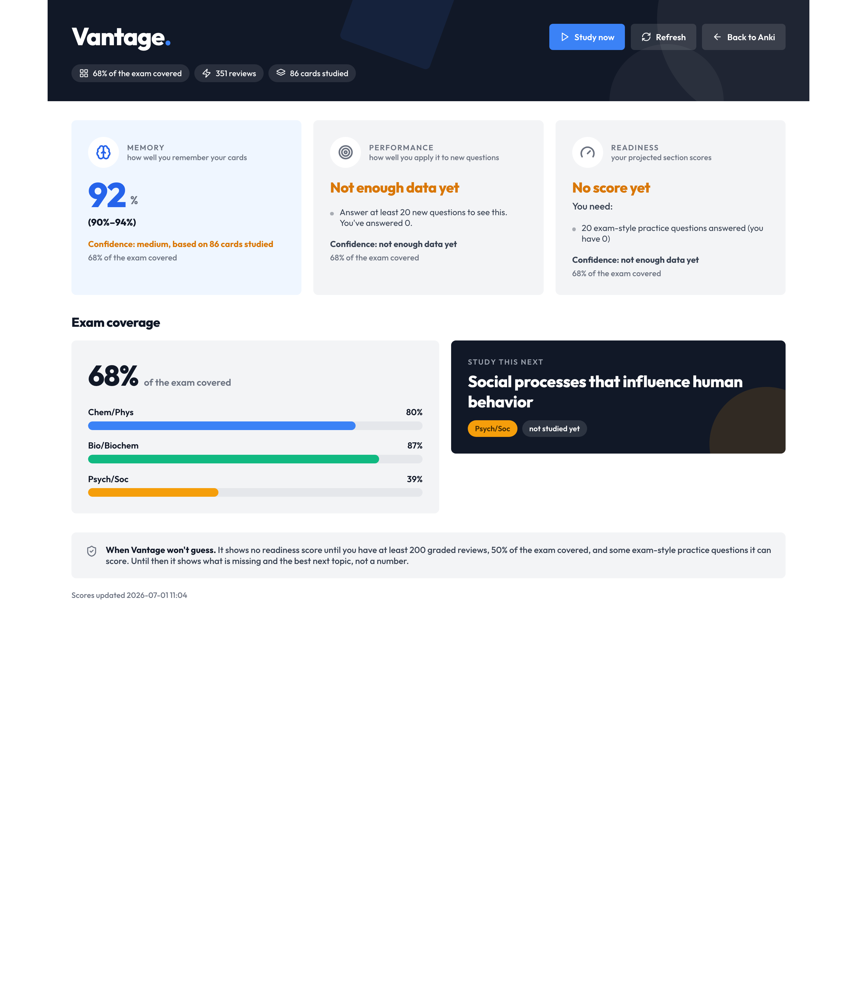

# Vantage test results (MCAT project)

Updated 2026-07-02. Everything below is reproducible from a clean checkout of this
fork after `./ninja pylib` (see `VANTAGE.md`). The Rust engine change and the honest
scoring layer are covered by unit tests; the re-runnable eval + safety harness is
covered by the one-command runners in the [justfile](../justfile) (`just eval-all`,
`just bench`, `just crash-test`, `just parity`).

## Downloads and evidence map

- **Run it without building:** desktop [`.dmg` + add-on](https://github.com/IsabellaChen70/anki/releases/latest) and Android [`.apk`](https://github.com/IsabellaChen70/Anki-Android/releases/latest).
- **Speed benchmark (50k deck), full detail:** [PERF_RESULTS.md](PERF_RESULTS.md).
- **Eval + ablation methodology:** [EVALUATION.md](EVALUATION.md).
- **Rust engine change write-up:** [../RUST_CHANGE_NOTE.md](../RUST_CHANGE_NOTE.md).
- **AI safety layer:** [../AI_NOTE.md](../AI_NOTE.md).



## Reproduce

```bash
# Rust: the topic-interleaving engine change (11 unit tests)
cargo test -p anki interleave

# Python: interleaving end-to-end + the honest scoring layer (98 tests)
PYTHONPATH=pylib:out/pylib ./out/pyenv/bin/python -m pytest \
  pylib/tests/test_interleave.py \
  pylib/tests/test_vantage_scoring.py \
  pylib/tests/test_vantage_collect.py -q

# Everything re-runnable in one shot (unit tests + all seeded evals + safety):
just eval-all
```

## Rust engine change: `cargo test -p anki interleave`

```
running 11 tests
test scheduler::queue::builder::interleave::tests::off_mode_is_identity ... ok
test scheduler::queue::builder::interleave::tests::single_topic_or_untagged_is_noop ... ok
test scheduler::queue::builder::interleave::tests::deterministic_with_seed ... ok
test scheduler::queue::builder::interleave::tests::mixed_separates_topics ... ok
test scheduler::queue::builder::interleave::tests::untagged_cards_form_their_own_bucket ... ok
test scheduler::queue::builder::interleave::tests::blocked_groups_topics ... ok
test scheduler::queue::builder::interleave::tests::uneven_buckets_repeat_only_at_tail ... ok
test scheduler::queue::builder::interleave::tests::confusability_biases_confusable_adjacency ... ok
test scheduler::queue::builder::interleave::tests::weighted_deterministic_with_seed ... ok
test scheduler::queue::builder::interleave::tests::empty_confusability_matches_naive ... ok
test scheduler::queue::builder::interleave::tests::build_queues_handles_note_with_multiple_review_cards ... ok

test result: ok. 11 passed; 0 failed; 0 ignored
```

Coverage: MIXED never places two same-topic cards in a row **while ≥2 topic buckets
remain** (and the honest tail case when they don't — `uneven_buckets_repeat_only_at_tail`);
BLOCKED groups by topic; a single/untagged topic is a no-op; untagged cards bucket
together; `Off` is the exact identity; order is deterministic for a fixed seed; the
confusability upgrade biases confusable pairs without starving others and is byte-identical
to naive when unset; and a note with multiple review cards is handled during queue build.

## Honest scoring + interleaving from Python: `pytest` (98 passed)

```
pylib/tests/test_interleave.py ........................................ 2 passed
pylib/tests/test_vantage_scoring.py .................................. 65 passed
pylib/tests/test_vantage_collect.py ................................... 31 passed
================================ 98 passed ================================
```

These cover: the outline + weighted coverage; the three scores (memory / performance /
readiness) with ranges; the give-up rule (≥200 reviews AND ≥50% coverage); calibration
(Brier, Wilson, IRT/EAP); reasoning outcomes as real sync-safe cards + revlog; per-device
metacognition merge (no clobber / no double-count); confusability pairing; and the
interleaving RPC end-to-end (no two consecutive same-topic cards, undo + integrity clean).

## Re-runnable evals + safety harness (committed artifacts)

Each writes a seeded result file; run individually or via `just eval-all`.

| Area | Command (`just …` or script) | Artifact | Latest result |
| --- | --- | --- | --- |
| Memory calibration | `just eval-memory` | `memory_calibration.json` | beats base rate +11.9% Brier; ECE 0.024 (CALIBRATED) |
| Performance calibration | `just eval-performance` | `performance_results.json` | beats base rate on held-out items |
| Paraphrase transfer gap | `just eval-paraphrase` | `paraphrase_results.json` | transfer gap surfaced; 1 FN reported |
| Interleaving ablation | `just ablation` | `ablation_results.json` | Part A mechanism CONFIRMED (mixed 0.000 < off 0.213 < blocked 0.903); Part B null ties, literature arm projected |
| Leakage scan | `just leakage` | `leakage_report.json` | clean (worst 0.50 < 0.80 cutoff) |
| AI retrieval + grounding | `just eval-ai` | `eval_results.json` | beats BM25 (R@3 80→86); grounding 0 false accepts |
| AI 3-way card gate (tuned) | `just eval-ai` | `cardcheck_results.json` | 34/8/8, 0 wrong published, 50/50 |
| AI card gate (independent held-out) | `just eval-ai` | `cardcheck_holdout_results.json` | 22/22 wrong blocked, 14/14 useful published, SAFE |
| AI wired-LLM seam screening | `just eval-ai` | `llm_seam_results.json` | hallucination + injection + fabrication all blocked; AI-off holds |
| Injection canary | `just eval-ai` | (stdout) | CAUGHT |
| Offline degrade | `just offline-test` | `offline_results.json` | AI off + scores locally; graceful on network loss |
| Score-mapping anchors + sensitivity | `just score-map` | `score_mapping_results.json` | monotonic; ±1 scale-pt sensitivity; pilot harness ready |
| Desktop↔phone scoring parity | `just parity` | `scoring_parity_results.json` | 27 values match to 2.8e-16 |
| Speed benchmark (50k) | `just bench` | `PERF_RESULTS.md` | all §11 p50/p95 budgets PASS |
| Desktop crash (20× kill) | `just crash-test` | `crash_results.json` | 20/20, zero corruption |
| Android crash (20× force-stop) | (device script) | `android_crash_results.json` | 20/20, zero corruption |
| Two-way sync reconcile (10+10) | (self-hosted server) | `sync_reconcile_results.json` | 351→371, 0 duplicates; later-review wins |

## Summary

| Suite | Command | Result |
| --- | --- | --- |
| Rust engine change (interleaving) | `cargo test -p anki interleave` | **11 passed** |
| Interleaving E2E + honest scoring (Python) | `pytest` (3 files) | **98 passed** |
| **Unit-test total** | | **109 passed, 0 failed** |
| Re-runnable evals + safety | `just eval-all` | all pass (see table above) |
